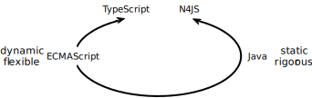

////
Copyright (c) 2016 NumberFour AG.
All rights reserved. This program and the accompanying materials
are made available under the terms of the Eclipse Public License v1.0
which accompanies this distribution, and is available at
http://www.eclipse.org/legal/epl-v10.html

Contributors:
  NumberFour AG - Initial API and implementation
////

:doctype: book
:notitle:
:toc: right

.N4JS and TypeScript
= N4JS and TypeScript

[.faq-intro]
N4JS and TypeScript are both supersets of ECMAScript. They both introduce type annotations and a
static type checker. However, in their relation to JavaScript, they follow different approaches.



TypeScript tries to make ECMAScript type-safe without invalidating existing ECMAScript code. Its
type system is optional and the TypeScript transpiler aims to accept plain ECMAScript wherever as possible.

Although N4JS is a superset of ECMAScript in terms of syntax and features, it does not
try to be compatible with ECMAScript at all cost.
One way of looking at the N4JS approach is to begin with ECMAScript, add Java's strict
and rigorous type system and then to make this amalgamation as flexible as possible.
The idea is that this fulfills the expectations of JavaScript programmers while keeping the type system sound.

[.language-n4js]
== Differences

In many cases TypeScript's design prioritizes the transition from ECMAScript to TypeScript
over type safety. N4JS was designed with ease of transition in mind, but type safety has a higher
priority than the ease of transition.

=== Any

Both languages introduce a type called `any`.
However, the precise meaning of `any` is probably the most important difference between N4JS and TypeScript.
Simply put:

**In N4JS you can do *nothing* with `any`, in TypeScript you can do anything.**

The following example illustrates the difference:

[source,n4js]
----
function f(p: any) {
    p.foo(); // error in N4JS, no error in TypeScript
}
----

N4JS will issue an error: `Couldn't resolve reference to IdentifiableElement 'foo'`, because in N4JS, the type `any`
has no properties.

Furthermore, in N4JS `any` is the top type: every type is a subtype of `any`. In TypeScript it is treated as a bottom
type similar to `undefined` (or `null`): `any` is a subtype of every other type. The effect of these different semantics is shown in the following example:

[source,n4js]
----
function bar(p: string) {
    p.charAt(0);
}

var s: string = "Hello";
var x: any = 42;

bar(s);
bar(x); // error in N4JS, no error in TypeScript
----

Of course, you would get an error at runtime: `TypeError: p.charAt is not a function`

The differing interpretations of `any` reflect the different approaches visualized in the figure at the beginning.
`any` in TypeScript is JavaScript in pure form: access anything, assign to everything. `any` in N4JS is even more rigorous than type `Object` in Java: access nothing, assign to nothing (except `any` itself).

////
It also illustrates how both languages are moving closer to each other: The better the type inferencer is and the more alternative concepts are provided, the less often any is to be used.
With the introduction of union types for instance, the usage of any has been reduced in TypeScript and N4JS.
Another example is "this" type, introduced with TypeScript 1.8 and also available in N4JS; it also makes some usages of any expandable.
////

N4JS allows developers to use types in dynamic way, by using the `+` type modifier.
This so-called *dynamic type modifier* allows for accessing arbitrary properties even when they are not known to the type system. The following example shows the effect:

[source,n4js]
----
function f(p: any, d: any+) {
    p.foo(); // error in N4JS
    d.foo(); // no error in N4JS, as `d` is "dynamic"
}
----

While `any+` resembles TypeScript's behavior of `any`, it is still more restrictive: `any+` will never be used as a default, it has to be declared explicitly; and a value of type `any+` still cannot be assigned to variables of other types except `any`.

|===
2+| h| access anything h| assign to everything h| used as default
.2+h| N4JS h| `any` h| no h| no  | •
h| `any+` h| yes h| no |
h| TypeScript h| `any` h| yes h| yes |  • footnote:[In TypeScript, implicit usage of `any` can be disallowed by means of a compiler flag.]
|===

=== Type Errors Are Show-Stoppers in N4JS

N4JS has two general levels of issues reported by the compiler: *warning*  and *error*.
Serious issues like type errors are treated as errors in N4JS and all errors will prevent the transpiler to emit any JavaScript code in order to avoid producing code that might cause exceptions at runtime.
For TypeScript, on the other hand, it is a main concern to never impede the developer, the transpiler will thus produce JavaScript output code even in the case of compile errors.
Given the example from the beginning

[source,n4js]
----
var str = 'Hello';
str = 42;  // <1>
str.charAt(2);
----
<1> Both N4JS and TypeScript show an error here.

The N4JS transpiler will reject the compilation of that code, while TypeScript will create a JavaScript output file
that causes exceptions at runtime in the last line.

=== Parameter Contra-variance vs. Bivariance

In N4JS, when overriding a method in a subtype, the types of the parameters may be super types, and the return type may be a sub type.
Compare this to Java, where the return type may also be a sub type, but the parameter types must be the same.
Given the following classes

[source,java]
----
class A           { fa() {} }
class B extends A { fb() {} }
class C extends B { fc() {} }
----

and the following super type

[source,java]
----
class Sup {
  f(b: B): B { return new B() }
}
----

a sub type of `Sup` may override `f` as follows:

[source,java]
----
class Sub extends Sup {
  @Override
  f(a: A): C { return new C() }
}
----

In type theory, this is expressed with co- and contra-variance: Given a type `Sup` with a method `M`, and a subtype of `Sub` with a method `N` overriding `M` (that is, `M` and `N` have the same names), then:

* the parameter types of overriding methods need to be contra-variant - the type of the parameters of `N` need to be super types footnote:[Super and sub type relation is reflexive here.] of the types of the parameters of `M`
* the return type of overriding methods need to be co-variant, that is the type of the parameters of `N` need to be a sub type of the return type of `M`

The same is true when checking assignability for function types, e.g.

[source,java]
----
f(callback: (B)=>B) {}
----

can be called with

[source,java]
----
f((a: A) => return new C())
----

In Typescript, the parameter types may be contra- or covariant, that is bivariant (see http://www.typescriptlang.org/docs/handbook/type-compatibility.html#function-parameter-bivariance[Handbook] and https://github.com/Microsoft/TypeScript/blob/master/doc/spec.md#3.11.4[TypeScript Spec, Assignment Compatibility] and https://github.com/Microsoft/TypeScript/blob/master/doc/spec.md#8.2.3[Inheritance and Overriding]).

This is *unsound*, as already stated in the TypeScript (http://www.typescriptlang.org/docs/handbook/type-compatibility.html#function-parameter-bivariance[Handbook]):

[quote,TypeScript Handbook]
This is unsound because a caller might end up being given a function that takes a more specialized type, but invokes the function with a less specialized type.

In the context of function objects (as in the example with the callback parameter) this may be quite convenient. And for that very special use case, we agree with the TS handbook:

[quote,TypeScript Handbook]
In practice, this sort of error is rare, and allowing this enables many common JavaScript patterns.

However, in the context of overriding methods and generics, this leads to severe problems, which are probably not that "rare".

==== Violated Substitution Principle

This assumed bivariance actually violates the so called https://en.wikipedia.org/wiki/Liskov_substitution_principle[subsitution principle]. In TypeScript, the following code is accepted without errors or warnings:

[source,java]
----
class TSSub extends Sup {
  f(b: C): B { b.fc(); return new B() }
}
----

The following function uses the super class `Sup` and assumes that its method `f` accepts a parameter of type `B`.

[source,java]
----
function g(s: Sup) {
  let b = s.f(new B());
}
----

The substitution principles states that we can use a subclass instead of the super class.
However, this is not true in case of TypeScript anymore.
The following code will create a runtime error:

[source,java]
----
f(new TSSub());
----

This will be surprising for the programmer of that call, but also for the developer of function `g`.

==== Use-Site Variance vs. Assumed Co-Variance

Parameter bivariance seems to solve some variance problems in the context of generics.
Let's have a look at the hello-world example for generics, a simplified list that can hold only a single element:

[source,java]
----
class List<T> {
   read(): T { /* .. */ }
   write(T)  { /* .. */ }
}
----

and two variables

[source,java]
----
let la: List<A>(), lb: List<B>;
----

Programmers familiar with Java or Scala know that it often causes headaches when using generics and assigning instances of generics.
Take the following assignments for example:

[source,java]
----
la = lb; // <1>
lb = la; // <2>
----
<1> This works in TypeScript. N4JS (and Java) issue an error
<2> Both TypeScript and N4JS (and Java) issue an error

On first glance, it looks great that TypeScript does not issue any errors here.
Since it's not obvious why both assignments are rejected by N4JS, let's have a look at what happens next:

[source,java]
----
la = new List<A>(); la.write(a); lb = la; lb.read().fb();
----

TypeScript would issue no errors, but we would get a runtime error in the last call:
since the list does not contain an instance of `B`, the method is undefined.
The same error occurs in the following case:

[source,java]
----
lb = new List<B>(); la = lb; la.write(a); lb.read().fb());
----

This is true because `List<T>` is invariant (that it is neither co- nor contra-variant):
* List is not co-variant: Even if `B` is a subtype of `A`, `List<B>` is not a subtype of `List<A>`
* List is not contra-variant: Even if `B` is a subtype of `A`, `List<B>` is not a supertype of `List<A>`

In practice, this is very inconvenient.
It would be O.K. to use `lb` instead of `la` assuming we only want to read from the list.
On the other hand, if we only want to write to the list then we could use `la` instead of `lb` since adding `B` s to a list expecting `A` does not do any harm.
There are different solutions to the same problem.

Java uses use-site variance, and this is also supported by N4JS.
When the list is used, we can define whether we want to read or write from it.
This can be done by using so-called 'wildcards' and constraints when parameterizing the list, for example:

[source,n4js]
----
function copy(readOnlyList: List<? extends A>, writeOnlyList: List<? super A>) {
   writeOnlyList.write( readOnlyList.read() );
}
----

Scala uses def-site variance, which is also supported by N4JS. In that case, you define at the definition of a generic type that a type variable is only used for read or write. E.g.,

[source,n4js]
----
interface ReadOnlyList<out T> {
  read(): T
}
interface WriteOnlyList<in T> {
  write(T): void
}

class List <T> implements ReadOnlyList<T>, WriteOnlyList<T> {
  @Override
  read(): T { /* .. */ return null;}
  @Override
  write(T) { /* .. */ }
}

function copy(readOnlyList: ReadOnlyList<A>, writeOnlyList: WriteOnlyList<A>) {
   writeOnlyList.write( readOnlyList.read() );
}
----

For more information on generics, please refer to the link:../features/generics.html[generics feature page].

== Similarities

=== Explicit and Implicit typing

In both languages, types can either be defined explicitly (via a type annotation) or implicitly.
In the latter case, the type is to be inferred by the type system. A simple example is the assignment
of a value to a newly declared variable, such as

[source,n4js]
let foo = "Hello";

Both languages would infer the type of `foo` to `string`.
In both languages the following assignment would, therefore, lead to an error:

[source,n4js]
foo = 42; // error

* N4JS would issue `int is not a subtype of string.`,
* TypeScript would issue ``Type `number` is not assignable to type `string```

=== Structural Types

N4JS and TypeScript both support <<../features/nominal-and-structural-typing#nominal_and_structural_typing,structural types>>.
This allows for managing relations between types without the need for excessive declarations.
Instead of explicitly defining type relations via `extends` or `implements`, the type system compares the properties of two types.
If one type has all the properties of another type, it is considered to be a subtype.

As a significant difference between the two languages, N4JS also supports **nominal types** and nominal typing **is the default**.
Thus, structural types have to be explicitly annotated as being structural, using the `pass:[~]` or `pass:[~~]` type constructors.

[cols="1a,1a"]
|===
^|N4JS ^|JavaScript

|
[source,n4js]
----
export public interface~Point {
    x: number;
    y: number;
}
export public interface~Point3D {
    x: number;
    y: number;
    z: number;
}
var p: Point = {
    x: 0,
    y: 10,
};
var p3d: Point3D = {
    x: 0,
    y: 10,
    z: 20
}

p = p3d;
p3d = p; // error
----

|

[source,javascript]
----
interface Point {
    x: number;
    y: number;
}
interface Point3D {
    x: number;
    y: number;
    z: number;
}
var p: Point = {
    x: 0,
    y: 10,
};
var p3d: Point3D = {
    x: 0,
    y: 10,
    z: 20
}

p = p3d;
p3d = p; // error
----
|===

NOTE: N4JS is using different defaults for access modifiers, e.g. `public` is not the default. For that reason, the interfaces have to be marked as public (and exported).

In both languages, an error will be issued on the last line:

N4JS:: `Point is not a structural subtype of Point3D: missing field z.`
Typescript:: `Type 'Point' is not assignable to Type 'Point3D'. Property 'z' is missing in type 'Point'.`

The difference between structural and nominal typing is described in further detail in the <<features/nominal-vs-structural-typing.html#nominal_vs_structural_typing,nominal vs. structural subtyping feature>>.

=== Using Existing JavaScript Libraries

An important aspect of being an ECMAScript superset is to enable developers to use existing JavaScript libraries. N4JS and
TypeScript support type definitions for existing code. For TypeScript, there is a great project called
http://definitelytyped.org/[DefinitelyTyped] where type definitions are collected. For
N4JS, a similar https://github.com/NumberFour/n4jsd[GitHub project] exists, but it contains
very few definitions at the moment. Contributions are welcome for both projects.

It is also possible to use existing code in both languages without type definitions, Common.js modules in particular.
The N4JS IDE <<../features/nodejs-support#nodejs-support,integrates support for NPM>>, so that these modules, even without a
type definition, can seamlessly be used in N4JS.
