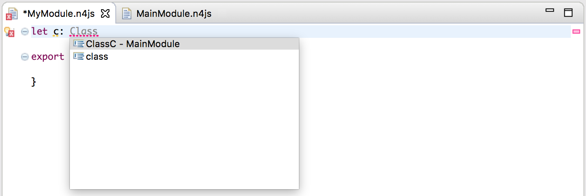

////
Copyright (c) 2016 NumberFour AG.
All rights reserved. This program and the accompanying materials
are made available under the terms of the Eclipse Public License v1.0
which accompanies this distribution, and is available at
http://www.eclipse.org/legal/epl-v10.html

Contributors:
  NumberFour AG - Initial API and implementation
////

:toc: right

.Modules
= Modules

Large-scale projects of almost any language require good modularization for maintenance reasons.
It's vital for projects that modules don't become oversized and comprise a well-defined purpose
that is easy to comprehend for developers. The N4JS IDE helps for keeping track of your code modules and validates their usage.

== Multiple Exports

While it's a good habit to assign one module for a single type, it may
be suitable to define multiple types or variables in a single module in cases where they
correspond or are related.
ECMAScript 2015 allows for this with the module syntax it defines. The good news is
that N4JS already supports most of it:

[source,n4js]
----
export public function inc(): void { ++count; }
export public var count = 5;
export default public class Foo {
    public callOnIt(): void { }
}
----

Importing an ECMAScript 2015 module and consuming exports is as easy as the following:

[source,n4js]
----
import { inc, count } from 'Counter';// Named imports
import Foo from 'Counter'; // Default import
import { readFile } from 'fs' // Node.js core modules
import express from 'express';  // npm modules
import * as plainJsModule+ from 'plainJsModule'; // Dynamic import
----

The module could also be imported as a whole:

[source,n4js]
import * as foo from 'Counter'; // Namespace import

NOTE: Anonymous default exports and relative module paths are not yet supported. The module specifier is the relative path of the
module in its source folder. Optionally the project name can be used as prefix, e.g., in case of ambiguities.

== N4JS IDE Organizes Imports

Manually writing import statements is not necessary: the N4JS IDE does this automatically.
The IDE will recognise all projects involved via various runtime and
library dependencies that are defined in by the user in the manifest.n4mf file.
Simply write the type or variable you require and press kbd:[Ctrl+SPACE].
Content assist within the IDE will add the missing import statement for you:

When pasting in a code snippet, you could use kbd:[Ctrl+Shift+O]
(on Windows and Linux, kbd:[Cmd+Shift+O] on Mac) which organizes your imports and
will add any that are missing. This is also used to clean up any unused imports:

image::images/organizeimports.png[]

== Import Removal

When developing in N4JS, you may notice that you sometimes need to import types to cast
a variable or use it for a constraint in a generic.

[source,n4js]
----
import Foo from 'Counter';

var someOtherVar: Object;
(someOtherVar as Foo).callOnIt();

export function <T extends Foo> bar(t: T): void { }
----

The compiler will notice that there's no runtime code dependency on the
imported module and will omit loading the module.

== Read-only Views

ES2015 modules have the concept of read-only views. Although you cannot modify anything imported from
a module, your binding is live. In the case that the exporting party has modified
the export, you will read the current value. For example:

[source,n4js]
----
import {inc, count} from 'Counter';

console.log(count); // 5
inc();
console.log(count); // 6
----

Although highly discouraged, read-only views allow to support some cyclic
dependencies across modules. N4JS might even reorder type definitions to achieve this.

== Loader Details

So far, there's no engine/platform that has implemented the ES2015 specification natively. N4JS
and most other transpilers, transpile modules into the SystemJS format.

N4JS' output format goes a bit further and emits an unified format that works as well in a
synchronous CommonJS/Node.js environment.
Keep in mind, however, that when you load a module the CommonJS way, you are
limited to this with regard to cyclic dependencies because it has to resolve all
dependencies synchronously.
