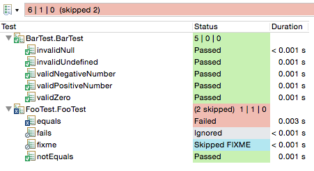

////
Copyright (c) 2016 NumberFour AG.
All rights reserved. This program and the accompanying materials
are made available under the terms of the Eclipse Public License v1.0
which accompanies this distribution, and is available at
http://www.eclipse.org/legal/epl-v10.html

Contributors:
  NumberFour AG - Initial API and implementation
////

.Testing
= Testing
:doctype: book
:toc: right

Test Driven Development (TDD) is one of the key techniques to write large systems with maintainable code.
The more tests you write, the more confident you can be that your software works as expected and the more
comfortable you feel when your refactoring the code, because the tests will tell you if you break something.
The N4JS language, the N4JS IDE and the built-in test execution runtime (Mangelhaft) were designed and developed
to support TDD as well as possible.

== Built-In Test Support

From the language perspective, there are annotations that can be used to declare and configure the test
suites. Mangelhaft is an https://en.wikipedia.org/wiki/XUnit[xUnit-like] framework that
provides an engine that executes the tests and reports back to the IDE while running the test suites.
The IDE is responsible for indicating the actual test results received from Mangelhaft to the user. For
creating a simple test suite, one requires an N4JS project with a test type source container, a test class
in the test type source container and at least one method declared in the test class with the `@Test`
annotation. This is described in more detail in the <<../userguides/tutorial#tutorial,tutorial>>.
Besides the test execution and reporting engine support, Mangelhaft provides various utility classes
that could come handy when test assertions or preconditions have to be used in the test suites or when negative tests are required.

[source,n4js]
----
import { Assert } from 'n4/mangel/assert/Assert';
import { Precondition } from 'n4/mangel/precondition/Precondition';

export public class FooTest {

    @Test
    public notEquals() {
        Assert.notEqual(36, 'foo');
    }

    @Test
    public iAmSuperstitious() {
        var today = new Date();

        // Skip running the test on each 13th Friday.
        var skipTestToday = this.is13thFriday(today);
        Precondition.isFalse(skipTestToday);

        // Rest of the test logic.
    }

    private is13thFriday(date: Date): boolean {
        …
    }
}
----

== N4JS Language Support

https://www.junit.org[Junit-like] annotations are are available to configure the test suits, such as:

`@Test` - The annotated method will be percepted as a test case when configuring and running the test suite.
`@Ignore` - The annotated method will be percepted as a test case when configuring the test suite but the marked case will be be executed as a part of the suite execution.
`@Fixme` - The annotated method will be percepted as a test case when configuring and running the test suite but the assertion logic will be negated.

Test classes can be created in the test container of any arbitrary project. With this approach,
the production code can be separated from the test code but both production and test code will
still be contained in the same N4JS project.

Another implementation is that of a 'test project'-type implementation whereby one can completely
separate the business logic form the test code. This is done literally using two separate projects;
one for the production and one for the test code. Aside from the code separation, the major advantage
of using a test project is that the default access visibility restrictions can be overruled.
Project-visible classes and interfaces and their non-visible members and methods can then be called
and tested from the test projects while still not visible in the production code. In a nutshell,
one can easily test different aspects of the application without breaking the encapsulation.

== N4JS IDE Support

In the N4JS IDE, the Test Results view provides an informative overview of all executed and running
test suites in a tree structure. Tests can be executed via the context menu's
**menu:Run As[Test in Node.js]** item directly from the editor or from
the Project Explorer view. It is possible to execute all tests form a particular project as well as
one single, fine-grained test case from a particular test class.

== Additional Features

* Navigate to test method.
* Showing stack trace for failed tests.
* Quick-test method overview in a popup window.
* Test suite history.
* Re-run previous test suite.
