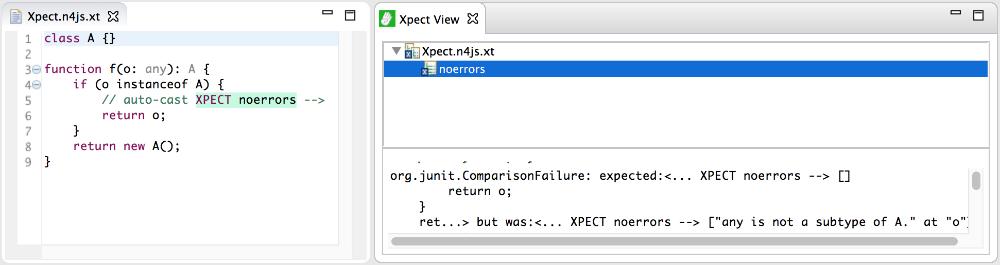

////
Copyright (c) 2016 NumberFour AG.
All rights reserved. This program and the accompanying materials
are made available under the terms of the Eclipse Public License v1.0
which accompanies this distribution, and is available at
http://www.eclipse.org/legal/epl-v10.html

Contributors:
  NumberFour AG - Initial API and implementation
////

:doctype: book
:notitle:

.Reporting Bugs
= Reporting Bugs

**We embrace bug reports and feature requests!**

For the moment, we use https://github.com/eclipse/n4js/issues[GitHub issues] to manage
issues found by users. We will soon migrate our current, internal list of bugs there. We greatly appreciate
all bug reports, thank you so much for your time!

If you like, you can try out a novel test technology called http://www.xpect-tests.org/[Xpect]
that was designed for writing tests for domain-specific languages and that we have integrated into the N4JS
IDE. It is described in detail in the coming section.

== Write Bug Reports with Xpect

With Xpect you can write concise bug reports and feature requests using N4JS and comments. What is a bug? A
bug usually is a programming error that leads to unexpected behavior. What is a feature? A feature is a
functionality provided by a system with a well-defined, i.e. expected, behavior. In other words: Bug
reports and feature requests both have to describe the **expected** behavior. Instead of long explanations
separated from the code, it is often easier to just add this **expectations** to the code.

The following screenshot shows a typical feature request (on the left hand side), written with Xpect:

The great thing about Xpect is that it actually defines a test. That is the feature request (or bug report)
can be executed. This is even possible within the N4JS IDE, and the result is shown on the right hand side
of the screenshot above. In order to do that, all you have to do is

  * Create a new file with extension `n4js.xt` (".xt" will activate Xpect)
  * Write the bug report or feature request, using comments and the keyword `XPECT` together with a known
xpectation type (see below)
  * Run the Xpect test from the context menu **menu:Run As[Xpect run]**.

**Instead of writing long explanations, just file the `n4js.xt` file as bug report (and a short explanation)!**

Note that in the screenshot the file does not contain any error markers - your expectation is already taken
into account during validations, improving the readability of the bug report. As shown in the screenshot above,
the Xpect test failed! In order to make things easier for the developer fixing the bug, you can add an additional
keyword `FIXME` to expectations you have but which are not fulfilled. In particular in longer reports with several
expectations, it is very helpful to easily identify what is expected and what is correct behavior. When running the
test again with the `FIXME` annotation, it will succeed as shown in the following screenshot:

image::images/xpect_fixme.png[]

**Bug reporting will be improved in future releases!**

In future releases, we will improve the Xpect support and simplify writing bug reports. In particular, we will
provide content assist or wizards for adding certain types of expectations.

In general, expectations are written inside comments preceding the line in the code which demonstrates the
un-)expected behavior, according to the following pattern:

[source]
// «remark» XPECT «type» FIXME --&gt;
«expectation» at «location»

  * *remark*: optional and can be omitted.
  * *type:* The type of the expectation is one of the types described in the table below.
  * *keyword* "FIXME": is optional and is used to indicate currently missing or unexpected behavior
  * *expectation*: optional, usually used for the expected issue message, or value; concrete semantic depends
on the expectation type.
  * *location*: used to further indicate the location of the problem, usually just the next line is assumed. The location has to be prefixed with `at` in most cases

If a single code line contains
several issues, multi-line comments are to be used:

[source,n4js]
/* «remark» XPECT «type» ---
"expectation1" at "location1"
"expectation2" at "location2"
...
--- */

Depending on the type of the expectation, the syntax may be a little bit different. The following table summarizes
the known types along with an example snippet to illustrate the syntax.

=== errors

Probably the most often used expectation type, indicates a validation error to be issued.

[source]
// XPECT errors FIXME --> "float literal assigned to int"
var i: int = 5.5;

=== warnings

    Similar to "errors", indicates a validation warning to be issued.

[source]
// XPECT warnings FIXME --> "float literal assigned to int"
var i: int = 5.5;

=== noerrors

See example above, used if no error is expected.

[source]
var a: A;
if (o instanceof A) {
  // I want type guards XPECT noerrors FIXME -->
  a = o;
}

More expectation types will become available in future versions.
