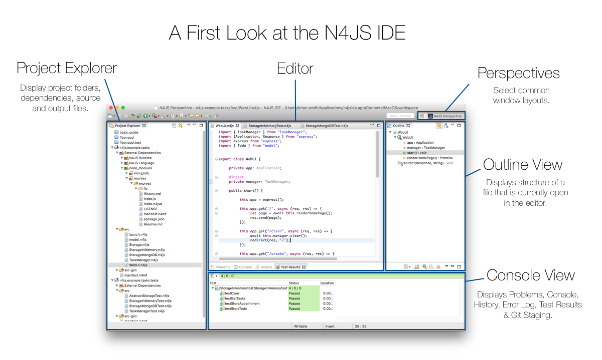
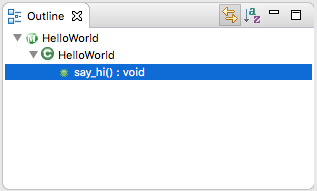
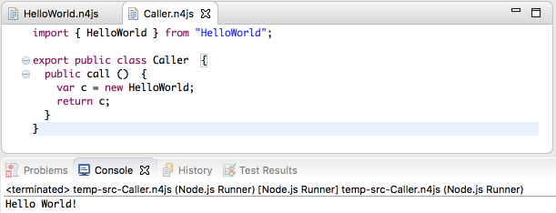

////
Copyright (c) 2016 NumberFour AG.
All rights reserved. This program and the accompanying materials
are made available under the terms of the Eclipse Public License v1.0
which accompanies this distribution, and is available at
http://www.eclipse.org/legal/epl-v10.html

Contributors:
  NumberFour AG - Initial API and implementation
////

:doctype: book
:toc: right
:toc-title: Jump to topic:
:commandkey: &#8984;

.N4JS IDE Setup
= N4JS IDE Setup

*Get the most from type safe development with the custom-built N4JS IDE*

In order to fully utilize the strengths of the language, N4JS has its own Eclipse-based IDE
with custom features designed to support safe and intuitive development of large-scale
server-side applications.
Code is validated as you type and workflow tools such as content assist
and quick-fixes ensure applications are written safely and consistently. The N4JS IDE
is a powerful tool for developing
collaborative projects that are to be maintained over a long period of time.

== Installation

For all available options for downloads and installation steps using the Eclipse Installer, see the link:https://www.eclipse.org/n4js/downloads.html[download page].

=== Requirements

*Java 11*

In order to run the N4JS IDE, Java 11 is required. Note that there exists a version of the IDE which
includes an embedded JRE-11. Java installer packages can be downloaded from
http://www.oracle.com/technetwork/java/javase/downloads/jdk8-downloads-2133151.html[Oracle's Java pages].
For Mac OS X users: Always install the *JDK* - the JRE is installed
and only used in web browsers, not applications.

*Existing Eclipse installation*

When installing the N4JS features into an existing Eclipse installation, Xtext 2.9.1 must be available.
In general, N4JS is based on the Eclipse Mars release.

*node.js*

In order to run or test code from the IDE, https://nodejs.org/en/[node.js 6] (or later) is required.

== Launching the IDE

image::images/startupprefs.png[]

When launching the N4JS IDE, a dialog box allows to specify a workspace which is used to
organize related projects in a single folder.
A new name and location for the workspace can be selected but for this example we shall
use the default settings.

TIP: To manage the workspaces that are displayed in the workspace launcher,
navigate to menu:Preferences[Startup and Shutdown,Workspaces]

*N4JS IDE Overview*

Developers who have previous experience using Eclipse will be familiar with many common UI
features such as the Editor, Project Outline, Project Explorer and Console views.
The arrangement of views can be easily selected using the perspectives icons as highlighted
in the upper-right of the window as shown above.

== Creating a new project[[new_project]]

After having set up a default workspace, a new project can be created using the New N4JS
Project wizard which is accessed at menu:File[New,N4JS Project] (Or using the keyboard shortcuts
kbd:[{commandkey}+ Option + N] for Mac,
kbd:[Alt-Shift-N] on Windows)

image::images/newproject.png[]

In this case, we name the project "hello.world" and select kbd:[Finish] to create a project in the
default location (our current workspace).
The New N4JS Project wizard will also ask to specify a working set to include the project in.
Working sets are for grouping together elements to be displayed and will allow the user to
focus on specific projects and files without
switching between workspaces. At this point, it is not necessary to add working sets, but when
dealing with
multiple projects, working sets can be a highly efficient way of switching between related
projects and resources.

=== Project Explorer

The Project Explorer view will display the structure of our new project:

image::images/projectexplorer.png[]

In the Project Explorer view, our project "hello.world" contains three folders with our resources:

* *src* will contain our .n4js source files.
* *src-gen* will contain the transpiled JavaScript that is generated after compiling n4js files.
The IDE automatically transpiles n4js files on save.
* *manifest.n4mf* is the project description file which contains descriptions of dependencies.

== Creating a new class[[creating_classes]]

In our new N4JS project, we can use the New N4JS Class wizard (accessed at *menu:File[New,N4JS Class]*
or kbd:[{commandkey} + Option + n])
to create a new class called "HelloWorld":

image::images/helloworldclass.png[]

Let's have a look at what a simple *HelloWorld!* example looks like in N4JS:

[source,n4js]
.HelloWorld.n4js
----
export public class HelloWorld {
  public say_hi() {
	  var message: string = "Hello World!";
	  console.log(message);
  }
}
var announce = new HelloWorld();
announce.say_hi();
----

We can see some similarities with Java and JavaScript in this example, but with some notable features:

* *export* makes the HelloWorld class available for import in another file or project.
We modify this using the *public* keyword to specify where it is available. This demonstrates
the use of *modules*
inside N4JS which are fully explained in the <<../features/modules#modules,Modules>> feature

* *string* we use the type annotation +string+ to define that the +message+ variable is of type *string*.
More can be read about type annotations in the <<../features/nominal-and-structural-typing#nominal_and_structural_typing,Nominal vs. Structural Typing>> feature.

As we have used the export keyword and made the class public using the +public+ *access modifier*,
it is possible to call the methods of this class in another project. If we wanted to restrict access
to this element, we would use +protected+
so it may only be accessed from subclasses and +private+ for within the same module only.
The default visibility of an element is +project+.

If we create a new class and define it as follows:

[source,n4js]
.HelloCaller.n4js
----
import { HelloWorld } from "HelloWorld";

export public class Caller  {
  public call ()  {
    var c = new HelloWorld;
    return c;
  }
}
----

We can run this module named "HelloCaller" and invoke the methods from our HelloWorld class.

== Outline View[[outline_view]]

The Outline View is a useful tool that provides a quick overview of the structure of our applications.
If we look at the Outline View while we are editing our HelloWorld examples, we can see the following:

The Outline View displays the structure of our very basic class with only one method. As
projects become more populated
and increase in complexity, the
Outline View becomes helpful by assisting with navigating through the structure of a file.

TIP: Instead of having the Outline View always open in the IDE, the shortcut kbd:[{commandkey}+O]
will open a Quick Outline window on demand. With this Quick Outline window open, begin typing to
easily search for fields, methods and classes.

== Running as node.js

To run this file, right-click inside the editor view and select *Run as | Launch in Node.js*:

The Console View will display the result of our +console.log+ command, and our Hello World!
example is running in the N4JS IDE without
errors.

== What's Next?

After creating a project and running some sample code, the next step we can have a look at is
exporting our project as an npm package followed by running it from the command line and
publishing to the npm registry. This is covered in the <<npm-export-guide#_npm_export_guide, export to npm>> guide.
