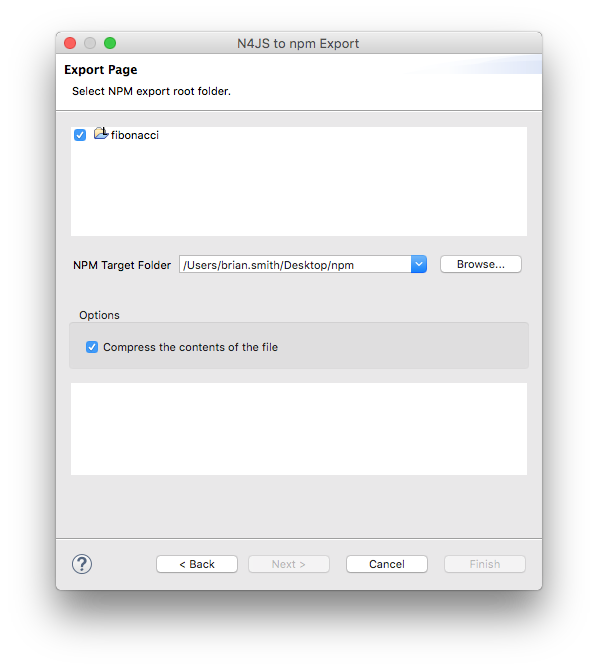

////
Copyright (c) 2016 NumberFour AG.
All rights reserved. This program and the accompanying materials
are made available under the terms of the Eclipse Public License v1.0
which accompanies this distribution, and is available at
http://www.eclipse.org/legal/epl-v10.html

Contributors:
  NumberFour AG - Initial API and implementation
////

:toc: right
:toc-title: Jump to section:
:commandkey: &#8984;

.N4JS npm Export Guide
= N4JS npm Export Guide

N4JS was created with the intention of supporting safe and intuitive Node.js development.
When a Node application
is ready to be published, the default
package manager is npm which is bundled with Node.js (a prerequisite of the N4JS IDE). npm is run on the
command
line and will organise and install
dependencies for an application. npm can also be used to install Node.js applications available on the npm
registry. This npm export guide demonstrates how N4JS can be used to develop and publish Node
applications with a simple example module.

== Project Example

In order to demonstrate exporting as npm, we can begin by creating a new N4JS
Project using the keyboard shortcut kbd:[{commandkey} + N] and naming
it "fibonacci". We then create a class "Fibonacci" and define it as follows:

[source,n4js]
.Fibonacci.n4js
----
 export public class Fibonacci {
 public seq()  {
      var arr = [];
          var a = 0;
          var b = 1;
          for (var n = 1; n < 15; n++)  {
            var current = a + b;
            arr.push(current);
            a = b + a;
            b = a - b;
          }
      console.log(arr);
      }
}
var run = new Fibonacci();
run.seq();
----

In the above example, we are creating a function which will iterate through the Fibonacci sequence,
push each new value into an array and report the results in the console after the for loop is complete.
When right-clicking the module and selecting menu:Run as[Launch in node.js], we have the
following output in the console:

image::images/fibonacciconsole.png[]

== Exporting as npm

To export our Fibonacci example, navigate to the Project
Explorer view, right-click our Fibonacci.n4js file or the project name and select *Export*.
An Export wizard will list the available types of exports.
Select *N4JS npm export* in the *N4JS Exports* folder.

image::images/exportwizard.png[]

On the following screen, we can select a target folder and click "Finish" to complete the export. There is
an option to compress the files on export which will create a tarball.

If we have a look in the target folder, we can see that a new folder has been created which is our
exported package. The contents of the package are:

* *Fibonacci.js* the Fibonacci.n4js file transpiled to JavaScript.
* *package.json* npm package description (name, author, version etc.) which is described in detail below.
* *manifest.n4mf* N4JS project dependencies.
* *Fibonacci.map* contains debugging information.
* *src* folder containing the original Fibonacci.n4js file.

== Running from the Command Line

In the example so far, we exported our npm package to a folder on the desktop called "npm". We create
a folder called *newinstall* located at `User/bsmith/Desktop/npm/newinstall`, but this can be anywhere
outside of the exported project folder.

With a Terminal window, cd to our new folder:
[source]
$ cd /User/Desktop/npm/newinstall

and install the package
[source]
$ npm install ../fibonacci

All dependiencies required for running the package will then be downloaded and installed
to the "newinstall" folder

[source,text]
/User/Desktop/npm/newinstall
└─┬ fibonacci@ 0.0.1
└─┬ n4js-node@ 0.3.1
├── n4js-es5@ 0.3.0
├─┬ node-fetch@ 1.4.1
│ ├─┬ encoding@ 0.1.12
│ │ └── iconv-lite@ 0.4.13
│ └── is-stream@ 1.0.1
└─┬ systemjs@ 0.19.25
└── when@ 3.7.7

We can now create a new JavaScript file saved as "index.js" that calls the method in our package. In our
case, the index.js only needs to contain the following line

[source,javascript]
.index.js
var fib = require("fibonacci/Fibonacci");

Our example module can now be called if we run the index.js file from the command line with node:

[source]
----
$ node index.js
[ 1, 1, 2, 3, 5, 8, 13, 21, 34, 55, 89, 144, 233, 377, 610 ]
$
----

If we wanted to run this node module by itself without the use of the index.js file, we can use the command

[source]
$ node -r fibonacci/Fibonacci

== Modifying Package Info

In our exported npm project, a package.json file is created from the project *manifest* which contains
information about the package. The minimum information required for a package.json file is:

* *name* of the package (all lowercase, one word, no spaces, dashes and underscores allowed).
* *version* following https://docs.npmjs.com/getting-started/semantic-versioning[semver conventions] i.e.
*1.0.0*.

Let's say we wanted to change the version of our npm package, we can edit this in the manifest.n4mf file
in the root of our fibonacci project:

[source,n4mf]
.manifest.n4mf
----
ProjectId: fibonacci
ProjectType: library
ProjectVersion: 1.2.3
VendorId: eu.mycompany
VendorName: "MyCompany AG"
Output: "src-gen"
Sources {
    source {
        "src"
    }
}
----

Above, we have made the simple change of our project from version "0.0.1" (the default) to "1.2.3"
and the package.json file will contain our new version number the next time we export as npm.

=== Editing the package.json from the Command Line

It's possible to edit the package.json from the command line by using `npm init` which is normally
used to create a new package:

[source]
$ cd /User/brian.smith/Desktop/npm/fibonacci
$ npm init

This will load a questionnaire that will cycle through the attributes of your existing package and
update the *package.json* file if new information is provided.

NOTE: It is recommended to edit the package information via the manifest.n4mf
file within the N4JS IDE as exporting the project again will overwrite changes made to the package.json
via the command line.

== Publishing to npm

In order to publish to npm, you must have an account on the npm registry. To store your credentials on the
client:

[source]
$ npm login

If you do not already have an account, use `npm adduser` to
create a new account. Test that your credentials are stored on the client with *npm config ls.

To publish our exported npm package, cd to the package and use the command `npm publish`

[source]
$ cd /Users/brian.smith/Desktop/npm/fibonacci
$ npm publish

We can now check if our package has been published to the registry, in our case, it would be published
at *https://npmjs.com/package/fibonacci*
