////
Copyright (c) 2016 NumberFour AG.
All rights reserved. This program and the accompanying materials
are made available under the terms of the Eclipse Public License v1.0
which accompanies this distribution, and is available at
http://www.eclipse.org/legal/epl-v10.html

Contributors:
  NumberFour AG - Initial API and implementation
////

:toc: right
:toc-title: Jump to topic:
:commandkey: &#8984;
:bib-file: ../../res/n4js.bib

.N4JS Tutorial
= N4JS Tutorial

*The flexibility of JavaScript with the type safety of Java*

N4JS is a language and IDE designed for developers who need to build scalable projects whose code should be
modular, reusable and easily maintainable over time. N4JS bridges the strengths of ECMAScript
(also known as JavaScript) and Java. The result is a typed JavaScript superset that is dynamic,
flexible and type-safe.

*Experience with JavaScript or Java?*

Developers who are experienced with JavaScript can easily apply their knowledge in N4JS. As N4JS is a
typed superset of ECMAScript, it is possible to use plain ECMAScript in N4JS. Most of the important
features from ECMAScript 2015 are supported, such as *modules* with import and export,
*classes*, *iterables* and *destructuring* of arrays
and objects. Developers with Java experience will be familiar with features from Java 8
such as *nominal typing*, *interfaces* and *generic classes
and methods*; even dependency injection and testing look similar.

*Development Environment*

N4JS has an IDE based on Eclipse. It comes with its own workspace, libraries and plugins. The
IDE has a transpiler (i.e. a compiler that translates from one language to another) which validates
N4JS code and then transforms it to JavaScript. The transpiler also performs imports from ECMAScript
to N4JS. The benefit of type safety means that errors in code are noticed while editing in the
IDE, allowing for problem-solving before code is ever deployed.

Developers who have previous experience using Eclipse will be familiar with most of the common UI features
such as Editor, Project Outline, Project Explorer and Console views. The arrangement of views
can be easily selected using the perspectives icons as highlighted in the upper-right of the window.

== Using N4JS to Implement a Node.js Application

The following screenshot shows
the most important views of the IDE:

image::images/ide.png[N4JS IDE, title="N4JS IDE"]

In order to illustrate some of the features of N4JS, we shall look at building a Node.js-based
server of a Task Manager which serves as a reminder or to-do list application. As we build this
basic example, we shall add improvements step-by-step, introducing new features with each
increment in order to demonstrate some of the strengths of the language and IDE through a
simple practical model.

Before we dive in and start creating our example, it is worth briefly describing the architecture
of our application in order to have a considered approach to the concept.  In this particular
example, we can think of a multi-tiered client-server structure. The idea here is that when we
have the application separated, each tier can be reused for different purposes.

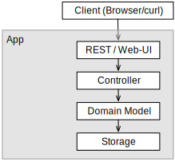

We will start with modeling and implementing the domain model before implementing a first
version of the storage tier which will enable our first tests. The controller is then built
using a test-driven approach. We later improve the storage tier using a real database
before adding a REST API with http://expressjs.com/[Express] and, finally, a simple Web UI.

== Creating a new N4JS Project

Let's begin by creating a new N4JS Project that contains our whole application. In case of
larger applications, we might want to create projects for each component (or tier) of the
application. In order to keep this example small, we will use only one project.

The "New N4JS Project" wizard can be accessed at menu:File[New, N4JS Project] (Or using the
keyboard shortcuts kbd:[{commandkey} + n] for Mac, kbd:[Alt+Shift+n] on Windows)

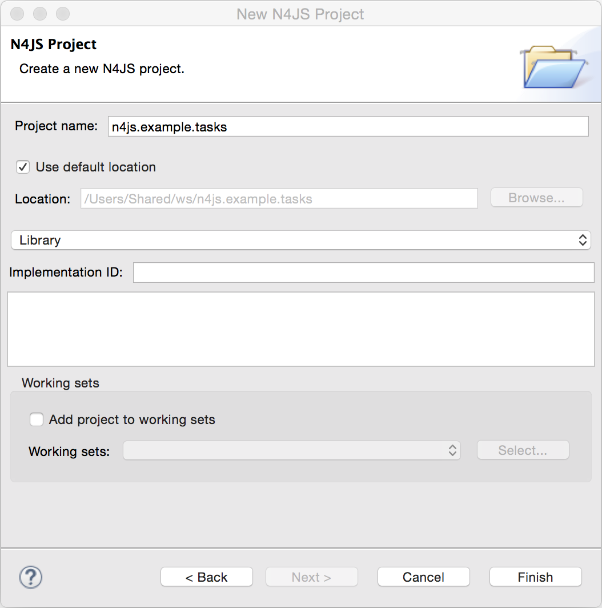

When we select kbd:[Finish], a new project folder is created with the following content:

* folder *src*: contains the .n4js source files for the project.
* folder *src-gen*: contains the transpiled JavaScript that is generated after compiling n4js
files. The IDE automatically transpiles n4js files on save.
* *manifest.n4mf*: project description file, containing description of dependencies.

=== The Domain Model

Before we start implementing the domain model, we shall take a look at a UML diagram of it:

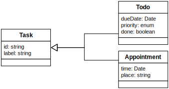

The UML diagram illustrates how the entities of our domain model are related
and which features the classes of the model will have.
We will begin by defining Task which is extended by Appointment and Todo.

=== Creating new classes and modules

In our new N4JS project, we can begin creating our entities. The easiest way to
do this is to utilize the New N4JS Class wizard, accessed via menu:File[New,N4JS Class]

image::images/newclasswizard.png[, 700]

N4JS supports modules introduced by ECMAScript 2015. A module contains functions,
classes and other declarations and code. The declared elements can be exported
and imported by other modules. We will use a single module for all classes of our
domain model. In larger projects, one might follow the Java convention to create
a single file per class.

The module specifier is the full path name of the module file, relative to the source
folder. We use Unix-like path separators, that is forward slashes "/". In the Class
Wizard (and later in import statements) we will omit the file extension.

In the above figure, we are creating a new class named Task which will be saved in
the module *model* in the project source folder.

==== Implement the entity classes

The class wizard has already created a file and the empty class "Task". We will
manually enhance this class as follows:

[source, n4js]
----
export abstract class Task {  // <1>
  public id: string?;
  public label: string?;
}
----

<1> In the first line of code, we have defined an *abstract class* named Task. Classes in
N4JS are similar to classes in ECMAScript 2015 or Java. The concept of an abstract
class is borrowed from Java. This means that we cannot have a _direct instance_
of Task in our model, but we may have _subclasses_ of Task.

We are populating the class with fields which are simple data fields of the class. This
is also borrowed from Java. The transpiler will move the field (with possible
initializers) into the constructor. The two data fields of Task are +id+ and +label+
which we have annotated with types. The N4JS transpiler will later remove these type annotations.

The type annotations declare the type of the data field. The type checker will issue
errors if we later assign values of a non-compatible type to the variables. The question
mark +?+ is a *type modifier* declaring the value as optional. That means that a new Task
may or may not have values assigned for their +id+ and +label+.

N4JS also provides the concept of *access modifiers* similar to Java with the modifiers
+public+, +protected+, +project+ and +private+. Access modifiers constrain the visibility
of elements, that is, they restrict from where an element can be accessed.

* `public` means that the element can be accessed from everywhere,
* `protected` may only be accessed from subclasses,
* `project` only from within the project (this is the default visibility)
* `private` accessed only from within the same module.

We now manually add two classes to the same file:

[source, n4js]
.model.n4js
----
/** An appointment. */ // <1>
export class Appointment extends Task {   // <2>
  public time: Date;     // <3>
  public place: string;   // <3>
}

export class Todo extends Task {  
  public dueDate: Date?;   
  public done = false;   // <4>
}  
----

<1> Appointment is prefaced with a *JSDoc* annotation (a comment beginning with pass:[/**] and
closed with pass:[*/] which documents that it is a single Appointment task. JSDoc comments are
used to provide markup annotation of your code. The content of these comments is displayed when
you hover over a reference to that element.
<2> The class Appointment is a *subclass* of Task. This is achieved by using the keyword
+extends+ and demonstrates *inheritance*. N4JS supports single class inheritance similar
to ECMAScript 2015 or Java. The subclass Appointment will inherit the members
+id+ and +label+ with types from Task.
<3> We add the members +time+ and +place+ with *type annotations*. The
type annotations of the members in Appointment are more strict than before, since
the optional modifier (denoted by the question mark) is missing. We will see the effects
of these different modifiers later on.
<4> Class Todo has a data field without type annotation but with an *initializer*. The N4JS
type checker can infer the type of the initializer, in this case a boolean literal,
and implicitly sets the type of the field to boolean.

In all classes we have defined above, we are using the ECMAScript 2015 +export+
keyword so that Appointment and Task can be imported and reused in other modules.
As the project grows, the benefits of having individual, reusable *modules* become
more and more useful in that they can be imported into other modules or even other projects.

=== Add an Enumeration

We also want to add a priority field to the `Todo` class. We will modify the
`Todo` class and add a new type `Priority` as follows:

[source, n4js]
.model.n4js (cntd.)
----
export class Todo extends Task {
  public dueDate: Date?;
  public priority = Priority.NORMAL;
  public done = false;
}

@StringBased // <1>
export enum Priority {
  LOW, NORMAL, HIGH
}
----
<1> Use string-based `enum` to simplify (de-)serialization

Enumerations allow us to represent a fixed set of constants: `LOW`, `NORMAL` and `HIGH`.
The reason we use an enumeration here is because we know all possible values for Priority
at compile-time so we may limit it to these constants. N4JS provides two kinds of
enumerations: "ordinary" and "string-based". The former
will be translated to objects, enabling extended reflection (for example to get the type of
the enumeration or get all literals). The latter will be translated to strings. Literals of
string-based enumerations are, in fact, represented as plain strings in the JavaScript
output code. As a result, they offer less reflection capabilities.

=== The Storage Layer

Let's first have a look at the UML diagram describing out storage tier:

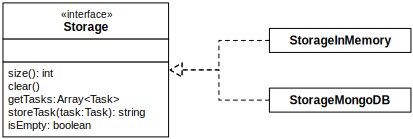

The storage tier is responsible for persisting our entities. We will create two
different kinds of "persistence". We will start with a simple in-memory peristence,
which can be used for testing. Later on, we will add a proper persistence layer using MongoDB.

==== Defining an Interface

We can create the storage module with the New Class wizard.
We call it "Storage.n4js", following Java's convention of naming the module similar
to the contained class or interface. We will manually edit the file as follows:

[source, n4js]
.Storage.n4js
----
import { Task } from "model"

export public interface Storage {

  size(): int
  clear()

  getTasks(): Array<Task>
  storeTask(task: Task): string

  isEmpty(): boolean {
    return (this.size()) === 0;
  }
}

----

The very first line of code displays ECMAScript 2015's import statement.
It is a so-called "named import": We import the element "Task", in
our case a class, from the module with the specifier "model".

This time, we do not define a class but an interface "Storage". N4JS
supports *interfaces* which operate similar to those in Java 8. Interfaces
are similar to classes, but they cannot be instantiated. In N4JS it is
however possible to use the "instanceof" operator with interfaces. Usually
interfaces contain abstract methods, but they can contain data fields,
getters and setters as well. Similar to Java 8, interface methods can
provide a default implementation. Here, we provide a default implementation for the method +isEmpty+.
Classes implementing the interface can either rely on the default
implementation or provide a more efficient one. As in Java, a class
can implement multiple interfaces, and also interfaces can extend multiple interfaces.

=== Implement the Interface

Since we cannot instantiate an interface, we need a class implementing the
interface. We will create a new module for a class called "StorageInMemory.n4js".
This module will simply keep all entities in memory. If you copy-paste the
following code snippet in your IDE, you will see a few errors. Do not fret,
it is expected and we will deal with them shortly.

[source, n4js]
.StorageInMemory.n4js
----
import { Storage } from "Storage"
import { Task } from "model"

export class StorageInMemory implements Storage { // <2>

  private lowestUnusedId = 1;
  @Final
  private tasks = new Map<string,Task>();  // <1>

  @Override
  public size(): int {
  return this.tasks.size;
  }

  @Override
  public storeTask(task: Task): string {
    let id = 'id' + this.lowestUnusedId++;
    this.tasks.set(id, task);
    task.id = id;
    return id;
  }

  @Override
  public clear() {
    this.lowestUnusedId = 1;
    this.tasks.clear();
  }

  @Override
  public getTasks(): Array<Task> {
    return Array.from(this.tasks.values());
  }
}
----

<1> The IDE will show an error here!

<2> We use the keyword +implements+ (known from Java) to define that this class implements
the interface. We have to provide specific implementation of the methods of the Storage
interface by using the `@Override` annotation to define `size`, `clear`, `getTasks`
and `storeTasks` (not all methods are shown here). This annotation is similar to
the annotation used in Java. It ensures that whenever a method in the interface is
changed, the type checker can issue a warning. This can be a lifesaver when larger
projects are to be maintained over time or across several development teams.

The above code will raise a compile error because type `Map` is not available
in ECMAScript Version 5. We'll have to tell N4JS that our example is intended
to run as ECMAScript 2015. Before doing this in the following section, let's
first look at the other parts of the above class declaration in more detail.

We use a data field `tasks` to store all the tasks in a map. The type Map stems from
ECMAScript 2015. It is a generic type similar to Array, which the observant reader may
have already seen in the Storage interface. N4JS provides support for generic types and methods
is similar to Java 8.

=== Edit the Manifest

By default, N4JS provides all the types known by ECMAScript 5. In order to use elements
(types, functions or variables) defined by a newer JavaScript version, we have to add
a corresponding runtime library as project dependency to the manifest. This has no direct
effect on the compiled code, it simply tells the type checker to assume that certain
types of a newer JavaScript version will be available at runtime (provided by the JavaScript
engine the code is intended for).

Such meta information about an N4JS project is kept in a so-called *manifest file*.
We need to open the `manifest.n4mf` file and edit a dependency. The default manifest
files created by the New Project wizard look like the following:

[source,n4mf]
.manifest.n4mf
----
ProjectId: n4js.example.tasks
ProjectType: library
ProjectVersion: 0.0.1
VendorId: eu.mycompany
VendorName: "MyCompany AG"
Output: "src-gen"
Sources {
  source {
    "src"
  }
}
----

We need to add the following section at the end. Note that the manifest editor supports content
assist similar to the N4JS editor.

[source,n4mf]
----
RequiredRuntimeLibraries {
  n4js-runtime-es2015
}
----

This will add all additionally defined types of ECMAScript 2015. It will also add new methods
 to types already defined in ECMAScript 5.

== Running a Module

Having created the first version of our domain model and storage tier, we are ready to try it out.
 For that, we create a module "Runner.n4js" with the following code:

[source, n4js]
----
import { StorageInMemory } from "StorageInMemory"
import { Todo } from "model"

let sim = new StorageInMemory();
let todo = new Todo();
todo.done = false;
todo.dueDate = new Date();
todo.label = "Test TODO";
sim.storeTask(todo);

console.log(sim.getTasks());
----

We then launch this module with Node.js. The easiest way to do that is with the context menu
(accessed by right-clicking in the editor) and selecting "Launch in Node.js". as shown in the
following screenshot:

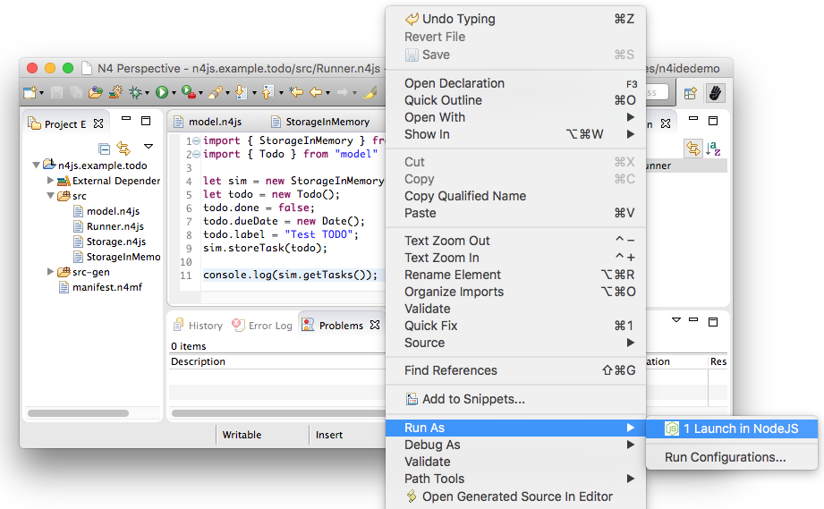

This will run the module currently opened in the editor. The output will be printed to the console
view, for example

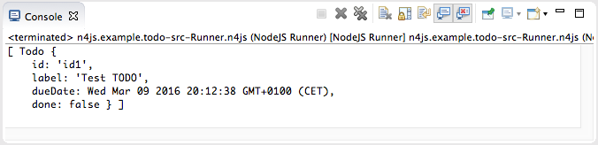

[.language-n4js]
== Extend Entities with Spec-Constructor

When we look at the runner code, creating a new task is quite annoying: It has to be created with
a new expression, and then every data field has to be set separately. To simplify this, we add
a constructor to our base entity class Task as follows:

[source, n4js]
.model.n4js (cntd.)
----
export abstract class Task {
  // ...

  constructor(@Spec spec: ~i~this=undefined) {  
  // code for initialization will be generated due to @Spec annotation  
  }  
}  
...
----

The concept of constructors is taken from ECMAScript 2015. However, the parameter is very special
to N4JS. We briefly describe the type expression `pass:[~i~this=undefined]` used here. The part `=undefined` declares
the default initializer of the parameter `spec` (c.f. ECMAScript 2015 cite:[ECMA11a]). Parameters which have default
initializers are optional, hence N4JS allows for omitting them in function calls (or in case of
constructors, in the `NewExpression`).
`this` is a known keyword in ECMAScript, it usually refers to the receiver of a property or, in case of classes,
method call. But here we use it as a type expression, referring to the type of the `this`
keyword. This is usually the class in which the method or constructor is defined. That is,
in case of Task it will be `Task`. However, we have two subclasses of `Task`. We do not
define a new constructor in these classes, instead we let these classes inherit `this`
constructor. In case of `Todo`, the `this` type will become `Todo` and in case of `Appointment`,
`Appointment`. Simply referring to the `this` type wouldn't make any sense in the constructor,
since we would need a first instance in order to create another one - but how could we
create the first one? The solution comes with the `pass:[~i~]` prefix.

As discussed in the feature sheet, N4JS supports nominal and structural typing. Structural typing
is activated in N4JS with the tilde `pass:[~]`. Two structural types are compatible, if they provide
the same properties, or in case of classes, public members. In the constructor, we only need to
set the fields. In N4JS, we can use `pass:[~~]` to refer to the so-called **field structural type**. Two
field structural types are compatible, if they provide the same fields - methods are
ignored in these cases. Actually, optional fields are also ignored. This explains why we marked
some of the fields with the optional modifier. Note that fields with an initializer are also
treated as optional (since the initializer provides a default value). Actually, N4JS can do even
more. There are several modifiers to further filter the properties or members to be considered:
`pass:[~r~]` only considers getters or data fields, `pass:[~w~]` only setters and data fields. `pass:[~i~]`  is used
for initializer parameters: For every setter or (non-optional) data field in the type, the
`pass:[~i~]`-type needs to provide at least a getter (or a readable data field). Optional fields
are also treated as optional in the field structural types.

For the concrete class `Todo`, the `pass:[~i~]`-type is not required to contain any property since all
its fields are either optional or have an initializer. It contains the optional fields `id`,
`label`, `dueDate`, `priority` and `done`. `pass:[~i~]Appointment` contains the required properties `time` and
`place`, and the optional fields `id` and `label`.

In most cases, we need this information in the constructor to set the fields accordingly.
For Task we would write:

[source, n4js]
----
constructor(spec: ~i~this=undefined) {
  this.id = spec.id;
  this.label = spec.label;
}
----

In order to simplify the code, the annotation `@Spec` tells the transpiler to add exactly this
code automatically. Even better: Since `Appointment` and `Todo` inherit the constructor, the
transpiler will add constructor code in these classes to set the additional fields also. That
is, with this single constructor, the `@Spec` annotation and the `pass:[~i~]this` type expression,
we have solved the problem of initialization for all our entity classes with a single stroke!

Using this `@Spec` constructor would then look similar to this:

[source, n4js]
----
let todo = new Todo({dueDate: new Date(), label: "Test TODO"});
sim.storeTask(todo);
----

*Short summary*

The main concepts demonstrated so far by our example are:

* *Modules* with import and export
* *Classes* with inheritance and constructors
* *Interfaces* with default methods
* *Enumeration*
* Special strategies for structural types
* *Manifest.n4mf* file and runtime library dependencies

We can now proceed to implement a Task Manager.

== Creating a Task Manager

We will now create the controller tier. This tier uses the entity and storage classes to provide
functionality that is actually useful for the user of the application.

Since we eventually want to implement a REST API (and use a real database), we need to introduce
asynchronous functions. So before we actually implement any controller class, we have to adjust our storage
tier to support asynchronous functions.

=== Make the Storage Asynchronous

If we would like to use a real database, all calls to the database will be asynchronous. Asynchronous
programming is a typical task in ECMAScript and there are several solutions to do this.

ECMAScript 2015 introduced a new class Promise which is supposed to be used with in these cases. Its methods
accept callback functions which are called once the asynchronous event has been triggered. Since these
callback functions tend to call other asynchronous functions, ECMAScript programmers easily end up in the so
called 'callback hell'. There is a proposal for upcoming ECMAScript versions to use special constructs in
the language to get rid of this callback hell. The idea is to mark asynchronous functions as "async" and,
when these functions are called, the program can "await" the result. This async/await feature is already
supported by several JavaScript frameworks and it is also built-in to N4JS including validation.

First we have to change the Storage interface and mark all methods which are supposed to be asynchronous as
`async`:

[source, n4js]
.Storage.n4js (cntd.)
------

import { Task } from "model"

export public interface Storage {

  async size(): int  // <1>
  async clear()

  async getTasks(): Array<Task>
  async storeTask(task: Task): string

  async isEmpty(): boolean {
    return (await this.size()) === 0;
  }
}
------

<1> Adding "async" to the size method and without adding the "await" keyword, you will get a
warning in method `isEmpty` similar to the following:

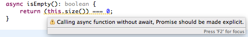

You will also get a lot of other errors in other files:

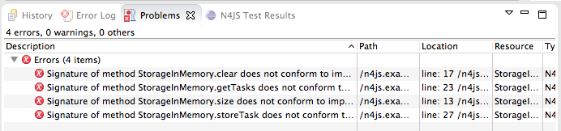

Without an async/await and type aware IDE you probably would have missed one or the other of these errors.
We can easily fix that by simply adding `async` to all the indicated methods.

If you still have the runner module, you probably will get a warning there as well. If you ignore that
warning and run it again, you will get the following

[source, n4js]
----
Promise { <pending> }
----

instead of the expected output. We are not going to fix this problem now as we will introduce a better way
of testing the code after the next step.

*Create TaskManager*

[source, n4js]
.TaskManager.n4js
----
import { Todo } from "model"
import { Task } from "model"
import { Storage } from "Storage"
import { StorageInMemory } from "StorageInMemory"

export public class TaskManager {

  private storage: Storage = new StorageInMemory();

  public async getTasks(): Array<Task> {
    return await this.storage.getTasks();
  }

  public async createTodo(label: string): string {
    let newTodo = new Todo({label: label});
    let newId = await this.storage.storeTask(newTodo);
    return newId;
  }
}
----

This class does not reveal any new concepts, but how do we test it? For that, we are going to use the N4JS
test framework.

By utilizing the built-in test suite, classes and modules will not become polluted with superfluous test-
code. In addition, it is possible to overcome some access modifiers restrictions so there's no need to
restructure or rewrite your code specifically to run tests.

Since we use a tier architecture, it is quite easy to add a test: We simply replace one tier with
appropriate tests:

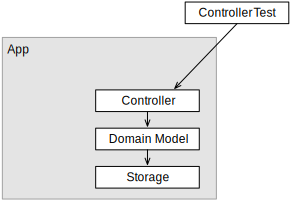

=== Testing

Since we do not want to mix up the application with the tests, we create a new project. We use the new
project wizard

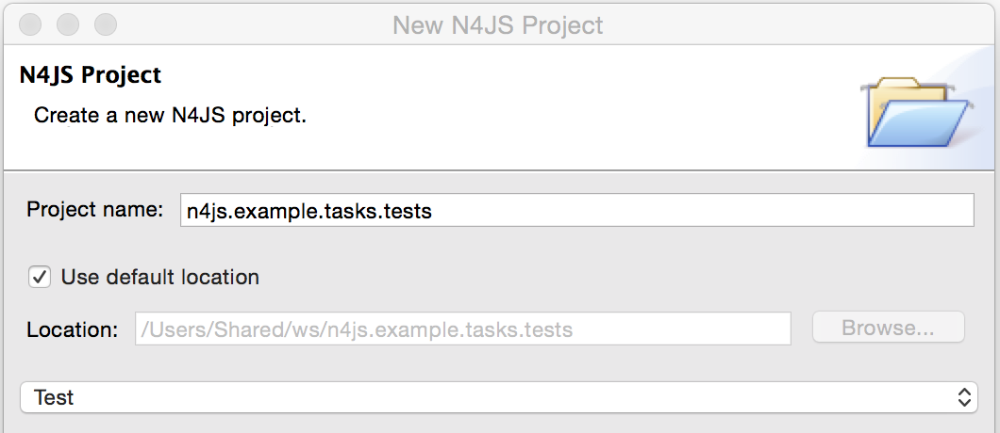

We adjust the `manifest.n4mf` accordingly:

* Define which project we test in the *TestedProjects* section.
* Change the *source* folder to *test* folder. This way the IDE knows where to look for tests later on.
* Add project dependencies to the built-in test framework "Mangelhaft", which also provides a comprehensive
collection of assert methods.

After adding these changes, the manifest of the test project will look as follows:

[source,n4mf]
.manifest.n4mf (in project n4js.example.tasks.tests)
----
…
TestedProjects {
  n4js.example.tasks
}
Output: "src-gen"
Sources {
  test {
    "src"
  }
}
ProjectDependencies {
  org.eclipse.n4js.mangelhaft,
  org.eclipse.n4js.mangelhaft.assert
}
----

We can now write our first test. Again, we use the class wizard to create a module "TaskManagerTest"
containing a class with the same name. The first test should look like that:

[source, n4js]
.TaskManagerTest.n4js
----
import { TaskManager } from "TaskManager"
import { Assert } from "n4/mangel/assert/Assert"

export public class TaskManagerTest {

  mgr: TaskManager = new TaskManager();

  @Test
  async testCreateTodo() {
    await this.mgr.createTodo("test todo");
    Assert.equal("test todo", (await this.mgr.getTasks())[0].label);
  }
}
----

Mangelhaft is an xUnit-like test framework. For the sake of simplicity, N4JS uses the same annotations as
the popular Java test framework JUnit. In our case, we have a single test method which needs to be annotated
with `@Test`.

Since we are testing asynchronous code, the test method needs to be asynchronous as well and we need to
"await" the results of the methods we call. Mangelhaft supports asynchronous code so we do not have to
bother about that any further. This is the nice thing about using `async`/`await` and N4JS: asynchronous
programming becomes as simple as synchronous programming!

We can run the test via the IDE. This works similar to launching the code with Node.js by simply using the
context menu. The IDE will detect a test and it will automatically add the correct menu entry to the context
menu:

image::images/testinnodejs.png[]

This will run the test and the test view will show the result of the first test:

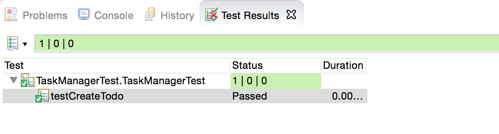

== Storage using MongoDB

Instead of "storing" the entities in memory, we want to use a real database. In this example, we are going
to use https://www.mongodb.com/[MongoDB]. To follow along this section on your own computer,
you must have MongoDB installed and start a data base server instance via the command line as follows:

[source,bash]
mongod --dbpath /db

In order to use MongoDB from N4JS, we need the appropriate npm package which allows MongoDB access from
ECMAScript. Adding this npm and making it available in N4JS is as simple as adding any project dependency.
We have to open the manifest editor (of the tasks project) and add the following project dependency:

[source, n4js]
----
ProjectDependencies {
  mongodb
}
----

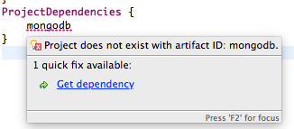

The quick-fix will automatically download all required npm packages, that is mongodb and all its
dependencies. We can now use mongodb from our N4JS code.

To let N4JS know about the types a particular npm package provides, an N4JS definition file with extension `.
n4jsd` is required (the same applies if you use a plain JavaScript file from N4JS). For some npm packages,
definition files are provided at https://github.com/NumberFour/n4jsd[github.com/NumberFour/n4jsd].

Let's assume for the moment there are no `.n4jsd` file available for MongoDB; we import MongoDB using
a *dynamic import* as follows:

[source, n4js]
----
import * as mongodb+ from "mongodb"

mongodb.MongoClient.connect('mongodb://localhost:27017/tasks', function (err: any+, db: any+) {
  if (!err) {
    // ... use data base ...
    db.close();
  }
});
----

However, since we do have an `.n4jsd` file available, we can import types such as `MongoDB`, `Collection`,
or `ObjectID` provided by MongoDB using an ordinary ECMAScript2015 named import, just as if we were
importing from an N4JS module:

[source, n4js]
.StorageMongoDB.n4js
----
import { Storage } from "Storage";
import { Task, Appointment, Todo } from "model";
import { Collection, Db, MongoClient, ObjectID } from "mongodb";

/**
* Persistence for task lists using a mongodb instance.
*/
export class StorageMongoDB implements Storage {
  cachedDb: Db = null;

  private async getTasksCollection(): Collection {
    if (!this.cachedDb) {
      this.cachedDb = await MongoClient.connect('mongodb://localhost:27017/tasks');
    }
  return this.cachedDb.collection('tasks');
  }

  public async shutdown() {
    this.cachedDb.close(true);
    this.cachedDb = null;
  }
}
----

In the above code section, we are implementing StorageMongoDB from the Storage interface and then calling
some of the standard MongoDB collection methods.

The next step is to retrieve the information about our Tasks and to store them in our MongoDB database. In
the storeTask method, we are then retrieving the inserted item id's from MongoDB and returning them as a
`task.id`.

[source, n4js]
.StorageMongoDB.n4js (cntd.)
----
export class StorageMongoDB implements Storage {

// ...

  @Override
  public async size(): int {
    let coll = await this.getTasksCollection();
    return await coll.count({});
  }

  @Override
  public async clear() {
    let coll = await this.getTasksCollection();
    await coll.deleteMany({});
  }

  @Override
  public async getTasks(): Array<Task> {
    let coll = await this.getTasksCollection();
    let resultRaw = await coll.find({}).toArray();
    let result = resultRaw.map((data): Task => fromData(data));  // <1>
    return result;
  }

  @Override
  public async storeTask(task: Task): string {
    let coll = await this.getTasksCollection();
    let result = await coll.insertOne(toData(task));
    if (result.insertedCount === 1) {
      task.id = result.insertedId.toHexString();
      return task.id;
    }
    throw new Error("insert document failed");
  }
}
----

<1> The use of the `=&gt;` arrow function, derived from ES6. Arrow functions have implicit lexical
binding and are less verbose than traditional function expressions.

The above code uses two helper functions, `toData()` and `fromData()`. Those illustrate two techniques available
in N4JS: reflection and so-called `@Spec` constructors, respectively. Reflection is known from many
languages and allows for retrieving information of a type and its members at runtime. It is used in
`fromData()` as follows:

[source,n4js]
.StorageMongoDB.n4js (cntd.)
----
function toData(task: Task): ~~Task {
  let metaClass = N4Type.of(task),
  data: any+ = {};
  // note: would have to set data._id, here, if we
  // wanted support for updating existing tasks
  data._type = metaClass.name;
  let taskAsObject: Object = task; // up-cast to object to allow index access
  for (let field of metaClass.dataFields(true,true)) {
    data[field.name] = taskAsObject[field.name];
  }
  return data;
}
----

Conversely, `@Spec` constructors are special constructors that allow us to create a new instance of a class and
initialize it with values provided by a plain data object in properties that correspond to the type's fields.

[source,n4js]
.StorageMongoDB.n4js (cntd.)
----
function fromData(data: any+): Task {
  let ctor = typeToCtor.get(data._type as string);
  if (!ctor) {
    throw new Error('Unsupported type of data model entity: ' + data._type);
  }
  let task = new ctor(data);
  task.id = (data._id as ObjectID).toHexString();
  return task;
}

const typeToCtor = new Map<string,constructor{Task}>([
  ['Todo', Todo] as Iterable2<string, constructor{Task}>,
  ['Appointment', Appointment] as Iterable2<string, constructor{Task}>
]);
----

Note that both functions `toData` and `fromData` should be declared outside of the `StorageMongoDB` class but in the same file `StorageMongoDB.n4js`.
By using the above two helper functions, we avoid sending our data model instances directly to the MongoDB
driver. Note that the entire implementation is intended for illustration purposes and in a real-world
systems many details would be handled differently, depending on the actual requirements.

[.language-n4js]
== Dependency Injection

We now have two implementations of the interface Storage. For testing, the in-memory solution is adequate,
but for the application we want to use the MongoDB solution of course. Since we are using the Storage in our
TaskManager class, we would need to change the TaskManager depending on the storage solution. This is
inconvenient and error prone. It would be much better if we could configure which storage class to use from
outside the TaskManager at some central location. This is possible with dependency injection.

To learn more about how dependency injection works, we have written an
<<../features/dependency-injection#dependency-injection, extended feature description>> that describes the benefits of this technique.
In short, N4JS provides built-in support for dependency injection using the same annotations as known from JSR-330/
Google Guice. Instead of using initializers calling the constructor for certain fields, we just mark them
with `@Inject`. We will do that with the storage field in the TaskManager class:

[source,n4js]
.TaskManger.n4js (cntd.)
----
export public class TaskManager {

  @Inject
  private storage: Storage;

  // ...
}
----

NOTE: After removing the constructor, the IDE will create a warning that one of the imports is unused. You
can easily fix that by using the "Organize Import" feature, either from the context menu (or via
kbd:[{commandkey}+Shift+O] on Mac OS, kbd:[Ctrl+Shift+O] on Windows).

How does N4JS now create the instance of storage? For that, we need an injector. An injector is responsible
for creating all variables annotated with `@Inject`. The injector is configured with a so-called "binder".
The binder is more or less a translation table telling the injector which type it should use to create a
concrete instance when a certain type is given. In our case, we need to tell the injector whether we want an
instance of StorageInMemory or StorageMongoDB. We are going to adjust the test accordingly.

For that, we first add a binder to the test module "TaskManagerTest.n4js":

[source,n4js]
.TaskMangerTest.n4js (cntd.)
----
@Binder
@Bind(Storage,StorageInMemory)
class InMemoryBinder {}
----

The annotation `@Binder` marks the class InMemoryBinder to become a binder. For each mapping we need to add
an annotation `@Bind`, which takes the requested type as the first argument and the actual type as the
second one. We only actually need to define bindings for interfaces. If the requested type is a class and if
no binding is defined for it, the injector will simply create an instance of that very type.

The next step is to create an injector. Fortunately, we do not have to do that manually. The dependency
injection framework of N4JS introduces the notion of dependency injection components (DIC). A DIC is
associated with an injector; this is done by using the annotation `@GenerateInjector`. Additionally we need
to tell the framework which configuration it should use for the injector, this is done via the annotation
 `@UseBinder`, which expects the type name of a binder class.

[source,n4js]
.TaskMangerTest.n4js (cntd.)
----
@GenerateInjector @UseBinder(InMemoryBinder)
export public class TaskManagerTest {
  …
}
----

The IDE helps us in finding problems: since the TaskManager class uses injection to get the storage field,
it needs to be injected itself. The IDE warns us in the TaskManagerTest class:

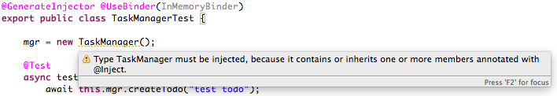

This is hard to find but easy to fix: We just have to replace the initalizer with an `@Inject` annotation.

[source,n4js]
.TaskMangerTest.n4js (cntd.)
----
…
export public class TaskManagerTest {
  @Inject
  mgr: TaskManager;
}
----

With these little changes, we can now configure the storage solution from outside the TaskManager class.
Running this test will behave as before but we have removed the hard-coded dependency from TaskManager to
StorageInMemory.

== Web UI module

The final step in building functionality into our model is to create a simple web user interface using
http://expressjs.com/[Express] as a dependency to create a web server. We will then pass our tasks from MongoDB into a small
 HTML page to display the results. We will create the web server using http://expressjs.com/[Express].

In order to use Express, we need the appropriate npm module. Adding this npm and making it available in
N4JS is as simple as adding any project dependency, as already shown for MongoDB, above. We have to open the
manifest editor (of the tasks project) and add the following project dependency (along with the existing
dependencies):

[source,n4mf]
.manifest.n4mf (cntd.)
----
ProjectDependencies {
  mongodb,
  express,
  n4js.lang
}
----

The dependency `n4js.lang` contains `N4Injector` which is needed later, so make sure it is declared as a dependency.

The quickfix will automatically download all required npm packages, that is, Express and all its
dependencies. We can now use Express in our N4JS code (for more details, esp. N4JS definition files, see
above description on MongoDB).

[source,n4js]
.WebUI.n4js
----
//Creating a simple Web User Interface in HTML

import { TaskManager } from "TaskManager"
import {Application, Response } from "express";
import express from "express";
import { Todo } from "model"

export class WebUI {

  private app: Application;

  @Inject
  private manager: TaskManager;

  public start() {

    this.app = express();

    this.app.get('/', async (req, res) => {
      let page = await this.renderHomePage();
      res.send(page);
    });
  }
}
----

Express is a web framework that provides (among other things) HTTP helpers for web routing. In the above
example, we are importing the classes `Application` and `Response` from Express and creating a home page
that we can render some HTML to. Next we will add a method for creating new tasks:

[source,n4js,subs=macros]
.WebUI.n4js
----
public start() {

// ... code shown above ...

  this.app.get("/create", async (req, res) => {
    let values = req.query as pass:[~]Object with {type: string, label: string};
    if (values && values.type === 'Todo' && values.label && values.label.length > 0) {
      await this.manager.createTodo(values.label);
    }
    redirect(res, '/');
  });
}
----

Have Express listen on port 4000 at localhost:

[source,n4js]
.WebUI.n4js
----
public start() {

// ... code shown above ...

  this.app.listen(4000, '0.0.0.0', 511, function() {
    console.log("HTTP server listening on http://localhost:4000/");
  });
}
----

Finally, we add a helper method for rendering a simple HTML page so we can view our Todos and edit them:

[source,n4js]
.WebUI.n4js
----
export class WebUI {

  // ... methods shown above ...

  protected async renderHomePage(): string {
    let tasks = await this.manager.getTasks();
    let todos = tasks.filter((task) => task instanceof Todo);
    return `
      <html>
      <body>
        Your to-do's:
        <ul>
          ${
            todos.length === 0 ? '<li><em>none</em></li>\n'
            : todos.map((todo) =>
            '<li>'+todo.label+' <small>(id: '+ todo.id +')</small></li>'
            ).join('\n')
          }
        </ul>
        

        <form action="/create" method="get">
          <input type="hidden" name="type" value="Todo">
          Label: <input type="text" name="label"> 
          <input type="submit" value="Create Todo">
        </form>
        

        <a href="/clear">[Clear All]</a>
      </body>
      </html>
      `;
  }
}

function redirect(res: Response, url: string) {
  res.header('Cache-Control', 'no-cache');
  res.redirect(301, url);
}
----
//`

At this point, we have to launch our web server. For this purpose, we create a small launch script that
configures the dependency injection (as shown in the section on dependency injection, above), creates an
instance of class `WebUI`, and invokes method `start()`:

[source,n4js]
.launch.n4js
----
import { Storage } from "Storage";
import { StorageMongoDB } from "StorageMongoDB";
import { WebUI } from "WebUI";
import { N4Injector } from "n4js/lang/N4Injector";

@Binder
@Bind(Storage, StorageMongoDB)
class Binding { }

@GenerateInjector
@UseBinder(Binding)
class Root { }

N4Injector.of(Root).create(WebUI).start();
----

You can now use the HTML page by going to http://localhost:4000/[http://localhost:4000/],
allowing you to interact with all of the logic we have built so far in order to read Todos, create new Todos
and clear the storage.

All of the fundamental elements of our model are completed and we have a functioning Task Manager with a
simple Web UI.

//////////////////////////////////////////
Testing Our Finished Model

TODO - Revise this section

We can use the annotation `@Before` to delegate the order in which certain tests take place. If we wanted to
mark a method to be executed once before each test in a given test class, we use `@Before` test annotation.
If we want a method to be executed once before all tests, such as clearing a database, we can use the
keyword `@BeforeAll`.

[source, n4js,subs=macros]
----
import { Priority, Appointment, Todo } from "model";
import { Storage } from "Storage";
import { Assert } from "n4/mangel/assert/Assert";

/**
* Contains the actual test cases for testing implementations of Storage.
* Subclasses will choose which concrete implementation to test.
*/
export public abstract class AbstractStorageTest {

  /** A storage intended for testing. Created in pass:[#]prepare() method. */
  private storage: Storage;

  protected abstract createStorage(): Storage;

  @BeforeAll
  async prepareStorage() {
    this.storage = this.createStorage();
  }

  @Before
  async clearStorage() {
    // make sure test storage is empty before each test starts
    await this.storage.clear();
  }

}
----

Using the test annotation `@BeforeAll`, we are creating the storage space a single time before running all
of our tests. The next section with the annotation `@Before`, ensures that the storage we created is cleared
before each test. After all tests are complete, we run a 'garbage collector' method telling MongoDB to
`shutdown` which cleans up all database resources and terminates the process.

[source, n4js]
----
@Test
async testStoreAppointment() {
  let s = this.storage;
  let appointment = new Appointment();

  Assert.equal(0, await s.size());
  let id = await s.storeTask(appointment);
  Assert.equal(1, await s.size());
  Assert.equal(id, appointment.id);
}

@Test
async testGetTasks() {
  let s = this.storage;
  let todo = new Todo({
  label: 'test',
  priority: Priority.HIGH,
  dueDate: new Date(2016, 3, 13, 14, 30, 0)
});

await s.storeTask(todo);
let restoredTasks = await s.getTasks();

Assert.equal(1, restoredTasks.length);
Assert.isTrue(restoredTasks[0] instanceof Todo);
let restoredTodo = restoredTasks[0] as Todo;
Assert.equal(todo.label, restoredTodo.label);
Assert.equal(todo.priority, restoredTodo.priority);
Assert.equal(todo.dueDate.getTime(), restoredTodo.dueDate.getTime());
}
----

Now that our AbstractStorageTest module is completed, we can create further test modules for other sections
of our project:

[source, n4js]
----
// Creating StorageInMemoryTest to extend AbstractStorageTest

import { AbstractStorageTest } from "AbstractStorageTest"
import { Storage } from "Storage"
import { StorageInMemory } from "StorageInMemory"

export public class StorageInMemoryTest extends AbstractStorageTest {

  @Override
  protected createStorage(): Storage {
    return new StorageInMemory();
  }
}
----

In this instance, we are importing AbstractStorageTest and overriding the `createStorage` method and
adapting it for use in testing our StorageInMemory module.

The same can be done to test our MongoDB module:

[source, n4js]
----
//Creating StorageMongoDBTest to extend AbstractStorageTest

import { AbstractStorageTest } from "AbstractStorageTest"
import { Storage } from "Storage"
import { StorageMongoDB } from "StorageMongoDB"

export public class StorageMongoDBTest extends AbstractStorageTest {

  @Override
  protected createStorage(): Storage {
    return new StorageMongoDB();
  }
}
----

By importing our test module and using method overriding, we can adapt and reuse the same test module for a
number of practical purposes, saving time and building an efficient testing system.

////

[.language-n4js]
== Export as npm

Finally, we can export our project as an npm package to integrate it into other Node.js projects or to
launch from command line.

* You can export one or multiple projects by selecting them in the Project Explorer and opening the
"Export ..." wizard by right-clicking on them. On the first page select "N4JS Exports / N4JS npm Export". For
the purpose of this example, only export project `n4js.example.tasks`.

* On the second page you have to choose a target folder to export to.

IMPORTANT: Export to a folder outside your Eclipse workspace!

* By default, the exporter exports as a directory. Optionally, you can export as a versioned tarball by
checking the option "Compress the contents of the file".
* The last page of the wizard shows a preview of the package.json file that will be created in the
exported npm package, together with a comparison to an existing package.json file in your N4JS project, if
present. You can place such a package.json file next to your `manifest.n4mf` file (optional), in case you
need
to define more https://docs.npmjs.com/files/package.json[specifics in the package.json], that
are not covered by the N4JS export wizard.

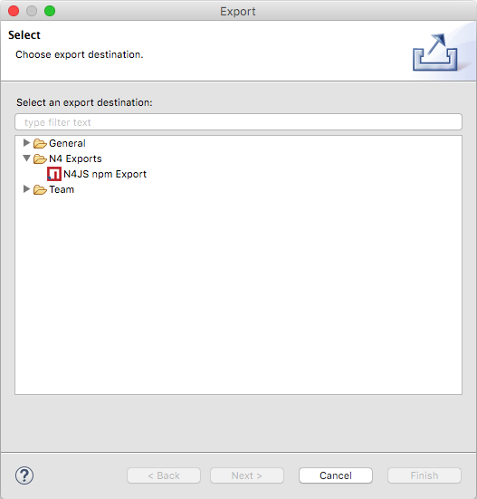

== Run from command line with Node.js

Once you've exported your project, you can either publish it to
https://www.npmjs.com/[npmjs.com] or install directly from your hard disk and call the launch
module, for example

[source,bash]
----
$ npm install -g n4js.example.tasks
$ node -r n4js.example.tasks/launch
HTTP server listening on http://localhost:4000/
----

In case you want to install dependencies and run it right away in the exported npm folder, you have to
manually set up the `NODE_PATH` to the folder hosting the exported npms, otherwise node cannot resolve the
project/npm IDs.

[source,bash]
----
$ export NODE_PATH=`pwd`
$ pushd n4js.example.tasks; npm install; popd
n4js.example.tasks@0.0.1 /Users/me/prj/n4js.example.tasks
├─┬ express@4.13.4
...
$ node n4js.example.tasks/launch.js
HTML server listening on http://localhost:4000/
----

So far we've been loading all code via node's `require()` function.
In case you want to load your modules via https://github.com/systemjs/systemjs[SystemJS],
which has more support to resolve cyclic dependencies across modules, you could use a handy starter
executable called `n4js`. The `n4js` starter is part of the `n4js-node` runtime environment npm (a default
dependency of any exported npm) and is therefore already installed:

[source,bash]
----
$ export NODE_PATH=`pwd`
$ cd n4js.example.tasks; npm install
n4js.example.tasks@0.0.1 /Users/me/prj/n4js.example.tasks
├─┬ express@4.13.4
...
$ ./node_modules/.bin/n4js n4js.example.tasks/launch
HTTP server listening on http://localhost:4000/
----

[bibliography]
== Bibliography

bibliography::[]
