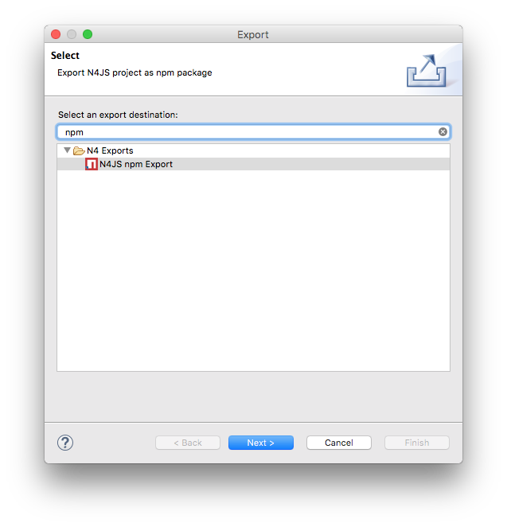

////
Copyright (c) 2016 NumberFour AG.
All rights reserved. This program and the accompanying materials
are made available under the terms of the Eclipse Public License v1.0
which accompanies this distribution, and is available at
http://www.eclipse.org/legal/epl-v10.html

Contributors:
  NumberFour AG - Initial API and implementation
////

:toc: right
:toc-title: Jump to section:
:commandkey: &#8984;

.N4JS Type Definitions Guide
= N4JS Type Definitions Guide

N4JS projects can depend on ordinary JavaScript projects by including them in the package.json file.
From there on, modules of those JavaScript projects can be imported when writing N4JS code.
However, since JavaScript is untyped there will not be any type information for e.g. classes, functions
of ordinary JavaScript projects unless this type information is provided by a type definition project.
Type definition projects do only contain n4jsd files that reflect the classes and functions of a specific npm.
To refer to the npm, the term implementation project will be used.

== Workflow

== Version Relation

Since the implementation project will evolve over time and publish different versions, the need arises to also
publish the type definition project in different versions that reflect this evolution.
In addition to the evolution of the implementation project, a new version of the type definition project can
also become necessary in case a bug was found in a previous version or in case the language of N4JS changes
and the type definitions have to be adjusted accordingly.
Effectively, this will lead to a situation where both the implementation and the type definition project have
a version that are technically unrelated from an npm point of view, but still are somehow related to each other
from a semantical point of view.

N4JS was created with the intention of supporting safe and intuitive Node.js development.
When a Node application
is ready to be published, the default
package manager is npm which is bundled with Node.js (a prerequisite of the N4JS IDE). npm is run on the
command
line and will organise and install
dependencies for an application. npm can also be used to install Node.js applications available on the npm
registry. This npm export guide demonstrates how N4JS can be used to develop and publish Node
applications with a simple example module.

== Project Example

In order to demonstrate exporting as npm, we can begin by creating a new N4JS
Project using the keyboard shortcut kbd:[{commandkey} + N] and naming
it "fibonacci". We then create a class "Fibonacci" and define it as follows:

[source,n4js]
.Fibonacci.n4js
----
 export public class Fibonacci {
 public seq()  {
      var arr = [];
          var a = 0;
          var b = 1;
          for (var n = 1; n < 15; n++)  {
            var current = a + b;
            arr.push(current);
            a = b + a;
            b = a - b;
          }
      console.log(arr);
      }
}
var run = new Fibonacci();
run.seq();
----

In the above example, we are creating a function which will iterate through the Fibonacci sequence,
push each new value into an array and report the results in the console after the for loop is complete.
When right-clicking the module and selecting menu:Run as[Launch in node.js], we have the
following output in the console:

image::images/fibonacciconsole.png[]

== Exporting as npm

exported package. The contents of the package are:

* *Fibonacci.js* the Fibonacci.n4js file transpiled to JavaScript.
* *package.json* npm package description (name, author, version etc.) which is described in detail below.
* *manifest.n4mf* N4JS project dependencies.
* *Fibonacci.map* contains debugging information.
* *src* folder containing the original Fibonacci.n4js file.

With a Terminal window, cd to our new folder:
[source]
$ cd /User/Desktop/npm/newinstall

[source,text]
/User/Desktop/npm/newinstall
└─┬ fibonacci@ 0.0.1
└─┬ n4js-node@ 0.3.1
├── n4js-es5@ 0.3.0
├─┬ node-fetch@ 1.4.1
│ ├─┬ encoding@ 0.1.12
│ │ └── iconv-lite@ 0.4.13
│ └── is-stream@ 1.0.1
└─┬ systemjs@ 0.19.25
└── when@ 3.7.7

We can now create a new JavaScript file saved as "index.js" that calls the method in our package. In our
case, the index.js only needs to contain the following line

[source,javascript]
.index.js
var fib = require("fibonacci/Fibonacci");

Our example module can now be called if we run the index.js file from the command line with node:

[source]
----
$ node index.js
[ 1, 1, 2, 3, 5, 8, 13, 21, 34, 55, 89, 144, 233, 377, 610 ]
$
----

If we wanted to run this node module by itself without the use of the index.js file, we can use the command

[source]
$ node -r fibonacci/Fibonacci

[source,n4mf]
.manifest.n4mf
----
ProjectId: fibonacci
ProjectType: library
ProjectVersion: 1.2.3
VendorId: eu.mycompany
VendorName: "MyCompany AG"
Output: "src-gen"
Sources {
    source {
        "src"
    }
}
----

used to create a new package:

[source]
$ cd /User/brian.smith/Desktop/npm/fibonacci
$ npm init

